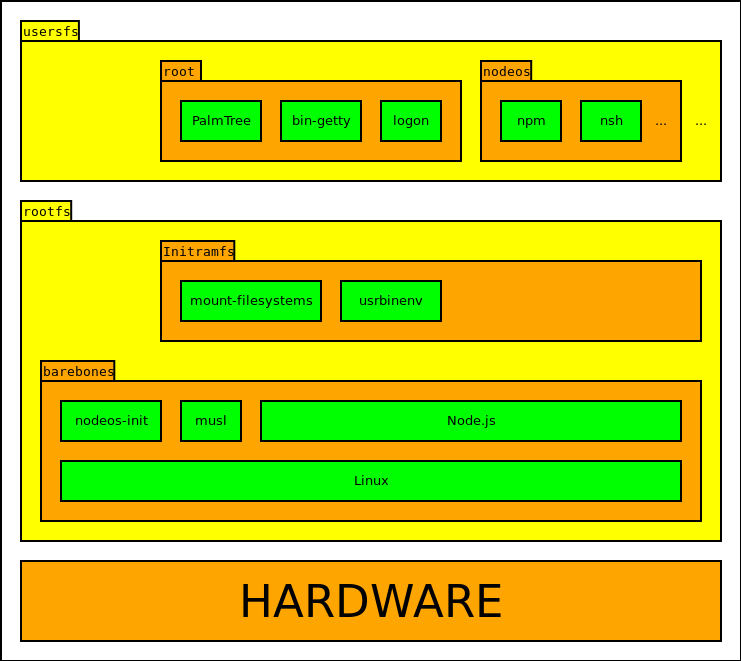

## Diseño

### División en capas



El sistema esta organizado en capas, correspondiente cada una de ellas a un
módulo npm independiente siguiendo la filosofía de diseño modular que promueve
la comunidad de Node.js, y su división sigue el diseño de la organización
original del proyecto basada en la arquitectura de contenedores de Docker, a las
cuales se les ha revisado el ámbito de actuación correspondiente a cada una de
ellas respecto a su proposito original. Dichas capas son:

* [barebones](3. Implementación/2. barebones.html), encargada de un arranque
  mínimo del sistema, mostrando directamente el interprete REPL de Node.js. Está
  formada solamente por el kernel de Linux, al que se le ha añadido un `initrd`
  que será usado posteriormente como sistema de archivos raíz común para todos
  los usuarios y que contiene a `musl` como libreria C estandar del sistema,
  [nodeos-init](3. Implementación/7. módulos propios/nodeos-init.html) para
  gestionar los procesos zombie y el apagado correcto de la máquina y el montaje
  del sistema de archivos *devtmpfs*, y el binario ejecutable de Node.js.
* [initramfs](3. Implementación/3. initramfs.html), monta la partición con los
  directorios de los usuarios y ejecuta una preparación previa del sistema.
  Consiste en un archivo `initramfs` independiente (a diferencia del `initrd`
  incluido en el kernel de Linux) que contiene los módulos
  [nodeos-mount-filesystems](3. Implementación/7. módulos propios/nodeos-mount-filesystems.html)
  y [usrbinenv](3. Implementación/7. módulos propios/usrbinenv.html), este
  último proporcionando una implementación en Javascript del ejecutable
  `/usr/bin/env`, empleado habitualmente en el *shebang* de los scripts
  ejecutables para indicar el programa interprete que puede procesarlos.
* [rootfs](3. Implementación/4. rootfs.html), genera una partición de arranque
  de sólo-lectura con el contenido de las dos capas anteriores según para que
  plataforma se este generando, de forma que después pueda grabarse en un disco
  o pendrive que puedan ser usados para arrancar el sistema de forma autónoma en
  hardware real como PCs o el micro-ordenador Raspberry Pi.
* [usersfs](3. Implementación/5. usersfs.html), ejemplo de partición con los
  directorios de los usuarios, incluido un usuario administrador *root*. Para
  permitir la autenticación del usuario de ejemplo *nodeos*, el usuario *root*
  incluye el gestor de tareas [PalmTree](https://github.com/lite20/palmtree), el
  cual controla el ciclo de vida del gestor de terminales
  [bin-getty](../8. apéndices/1. colaboraciones con proyectos externos/node-bin-getty.html),
  y el módulo [logon](3. Implementación/7. módulos propios/logon.html) encargado
  de la autenticación distribuida de los usuarios.

Cada capa es autónoma en si misma pudiendo ejecutarse independientemente, y se
apoya en las anteriores para ofrecer su funcionalidad. Por ejemplo, usando la
capa *barebones* de forma aislada, ejecuta el kernel de Linux y ofrece acceso a
un interprete REPL de Node.js, similar al ofrecido por algunos microcomputadores
de los años 80 como el
[Sinclair ZX Spectrum](https://es.wikipedia.org/wiki/Sinclair_ZX_Spectrum),
aunque usándose en este caso Javascript en vez de BASIC como lenguaje.

### Módulos

Los módulos correspondientes a cada capa están integrados dentro del código del
proyecto principal, aunque están diseñados como módulos independientes. Esto es
así por dos razones:

1. la normativa del Concurso de Software Libre indica explícitamente que
   "[solo se podrá participar en un proyecto a la vez](http://www.concursosoftwarelibre.org/1415/bases)",
   lo que implica indirectamente que sólo puede usarse un único repositorio.
   Debido a la filosofía modular de Node.js en condiciones normales se usaría un
   repositorio distinto para cada una de las capas provocando que posteriormente
   se evaluase un repositorio "vacío" al estar toda la funcionalidad en otros
   proyectos externos, por lo que decidí organizarlas como
   [bundledDependencies](https://docs.npmjs.com/files/package.json#bundleddependencies)
   hasta la finalización de dicho concurso.
2. npm antes de la versión 3 tenia varias limitaciones que imposibilitan el
   poder instalar los módulos correspondientes a las distintas capas de forma
   independiente, como es la instalación de las dependencias sin un orden bien
   definido, diversos bugs en los que se instalan paquetes sin haberse instalado
   primero correctamente sus dependencias, o la mas importante la instalación de
   dependencias en árbol, lo que provocaría que se generara el cross-compiler
   varias veces desperdiciando mucho tiempo en su generación al no usarse una
   única copia, para lo que se propuso que estas se comprobaran e instalaran
   [antes que la propia dependencia](https://github.com/npm/npm/issues/7917), de
   tal forma que haya un orden de instalación de las dependencias claramente
   definido.

No obstante, la intención a largo plazo es que las distintas capas del sistema
estén en distintos proyectos y que los problemas relativos a npm estén resueltos
cuando se adapte el sistema a npm 3, al incorporar la instalación multi-etapa y
usar una jerarquía de dependencias máximamente plana. También se plantea dividir
dichos módulos en otros mas específicos, como son el binario de Node.js o el
kernel de Linux, o incluso la posibilidad de que los módulos instalados por los
usuarios dentro de su directorio puedan también ser considerados dependencias de
cara a una posterior re-instalación de estos en el mismo o en otro sistema.

Aparte de los módulos correspondientes a cada una de las capas del sistema,
también se ha hecho un módulo específico para la generación del cross-compiler,
de forma que éste también este integrado dentro del ciclo de vida de npm, y la
compilación de los distintos módulos sea independiente del sistema subyacente.
También se ha hecho que el propio sistema este definido como un paquete npm,
aunque al delegar toda su funcionalidad a los módulos de cada una de las capas
del sistema (o a módulos externos) su funcionalidad es mínima y se reduce a
recolectar los componentes generados por cada una de las distintas capas y poder
ejecutarlas con QEmu, y según la plataforma para la que se este generando además
crear una imagen de disco o un archivo `zip` para su publicación.

El paquete que engloba el proceso completo de construcción de NodeOS esta
definido como [privado](https://docs.npmjs.com/files/package.json#private) para
evitar su publicación en el registro npm al no tener librerías o componentes
directamente consumibles por otros módulos, ya que la forma de uso esperada es
que se descargue su código fuente desde el repositorio de GitHub y se genere a
partir de él, y que las versiones personalizadas o derivabas de NodeOS
("[sabores](../../6. conclusiones/2. Posibles trabajos futuros.html#"Sabores")")
se creen mediante forks de este proyecto principal, como ocurre en el caso de
[whale](https://github.com/bash/whale). Esto está facilitado precisamente por la
filosofía modular de Node.js, ya que permite que este paquete principal sea
mínimo y las personalizaciones se reduzcan a definir sus dependencias en otros
paquetes alternativos, lo cual además facilita que haya una gran cantidad de
paquetes comunes en todos ellos haciendo todas las versiones derivadas uniformes
y compatibles entre si.

Además, al estar basada la administración en npm, hace que el sistema sea muy
modular y personalizable, y se puedan testear cada uno de sus componentes por
separado aumentando la fiabilidad del sistema. Además, se dispone de acceso a
los mas de 270.000 paquetes disponibles actualmente, siendo compatible con
cualquier otro sistema operativo donde pueda ejecutarse Node.js.

### Sistema de archivos raíz único para cada usuario

La capacidad de poder ofrecer un sistema de archivos raíz único e independiente
por cada usuario es posible gracias al uso combinado de OverlayFS y chroot.
[OverlayFS](https://www.kernel.org/doc/Documentation/filesystems/overlayfs.txt)
es un sistema de archivos que permite apilar varios sistemas de archivos en un
único punto de montaje al estilo de [UnionFS](http://unionfs.filesystems.org) en
[FreeBSD](https://www.freebsd.org) o [bind](http://man.cat-v.org/plan_9/2/bind)
en [Plan 9](http://plan9.bell-labs.com/plan9), e introducido dentro del
repositorio principal del kernel de Linux en la versión `3.18-rc2`, el cual se
mejoró posteriormente en la versión `3.20-rc1` (después renombrada a `4.0-rc1`
cuando se decidió no usar en el desarrollo del kernel números de versión menor
[excesivamente grandes](https://plus.google.com/+LinusTorvalds/posts/jmtzzLiiejc))
añadiendo soporte para usar varias capas de sólo-lectura en el mismo punto de
montaje.

La estructura empleada consiste en usar el sistema de archivos raíz ubicado
dentro del *initram* como sistema base de sólo-lectura, montando encima el
directorio de cada usuario y después creando una jaula `chroot` dentro de el. De
esta forma, los usuarios quedan contenidos dentro de su propio directorio de
usuario y aislados tanto del sistema como entre si, lo que permite por ejemplo
que el usuario modifique o sobrescriba los elementos comunes contenidos dentro
del *initram* como son el binario de Node.js y las librerías dinámicas del
sistema, ya que todos esos cambios quedaran reflejados únicamente en su propio
sistema de archivos raíz alojado dentro de su directorio de usuario.

La creación de la jaula se ha hecho mediante el uso de un proceso intermedio
para hacer mas simple la perdida de privilegios de la jaula y del proceso final
a ejecutar, ya que *chroot* requiere ser invocado con permisos de administrador.
Los pasos empleados para el mismo (con algunas variaciones) han sido:

1. Inicio del proceso intermedio indicando el comando final con sus argumentos
   y el `UID` y `GID` con que este debe de ser finalmente ejecutado.
2. Creación de la jaula *chroot* e introducirse en ella.
3. Disminuir los permisos del proceso cambiando explícitamente tanto su `UID`
   como el `GID` efectivos.
4. Ejecutar el comando deseado con sus argumentos.
5. Terminar el proceso intermedio.

De este modo, el comando se ejecuta estando ya dentro de la jaula *chroot* y con
sus permisos disminuidos, por lo que no se depende de que este haga dicha tarea,
y además no queda corriendo ningún proceso que pueda ser explotado para dar
lugar a una escalada de privilegios. Como medida adicional de seguridad, se ha
establecido el *umask* de los archivos por defecto a `0077` (*rwx------*) para
permitir sólamente al propietario de los archivos acceder a estos, además de
definir los permisos de los directorios del sistema a `0111` (*--x--x--x*), de
forma que sólo el usuario administrador pueda listar su contenido, mientras al
mismo tiempo el resto de usuarios puedan acceder a los mismos (como es el caso
del ejecutable `/usr/bin/env`, usado en el *shebang* de los scripts de Node.js y
otros lenguajes interpretados).

Mediante esta técnica, se genera una jerarquía de archivos uniforme donde a
efectos prácticos el directorio del usuario es la raíz del sistema. Esto se
manifiesta, por ejemplo, cuando el usuario instala paquetes npm globalmente,
para lo cual no requiere permisos de administrador a diferencia de en sistemas
normales. Esto mismo también podría conseguirse mediante el uso de la variable
de entorno `npm_config_prefix`, pero en este caso puede funcionar con la
configuración por defecto sin afectar a los demás usuarios.

El uso de *OverlayFS* y de un sistema de archivos propio por cada usuario tiene
otra ventaja, y es que seria muy fácil que los usuarios definieran en su script
de inicio el que se montara una unidad de almacenamiento en linea como Dropbox,
Google Drive o Amazon S3 como directorio de usuario combinándolo con algún
mecanismo de cache en local, haciendo que todos sus archivos estuvieran de forma
transparente accesibles en cualquier momento desde Internet.

### Interfaz gráfica basada en HTML5

NodeOS propone que las aplicaciones gráficas utilicen una interfaz basada en
HTML5. Esta última no está completamente terminada y se ha planteado como una
futura mejora, aparte de que por arquitectura será implementada como un proyecto
independiente, pero sí se han implementado algunos de los componentes necesarios
para la misma debido a que permiten ser utilizados mas alla de solamente en las
aplicaciones gráficas, y por tanto ya estan incorporados en el sistema.

Para poder acceder a la interfaz gráfica proporcionada por cada usuario o a los
archivos pertenecientes al mismo desde Internet sin requerir del uso de un
servidor web con acceso global, ni que este corriendo permanentemente un
servidor web para cada uno de los usuarios, se han desarrollado los módulos
[nodeos-reverse-proxy](https://github.com/piranna/nodeos-reverse-proxy) y
[oneshoot](https://github.com/piranna/oneshoot), los cuales permiten
respectivamente hacer uso de las credenciales proporcionadas mediante
[HTTP Basic Auth](https://tools.ietf.org/html/rfc2617) (usando el módulo
[logon](3. Implementación/7. módulos propios/logon.html) para el control de
acceso) para redirigir las peticiones al servidor web propio de cada usuario
(ejecutándolo con los permisos del mismo en caso de que no esté corriendo
ninguno en ese momento), y el crear servidores web que se terminen
automáticamente cuando no hay mas conexiones abiertas a los mismos. Además,
también puede ejecutar los servidores de backend propios de cada una de las
aplicaciones gráficas que los necesiten, identificándolos mediante el uso del
nombre de su módulo o de su ruta completa entre brackets (`[` y `]`) como primer
componente de su ruta. Por ejemplo, ante la petición

```url
ws://nodeos@nodeos:12.34.56.78/[steam]/games/hl3
```

en la máquina con IP `12.34.56.78` *nodeos-reverse-proxy* comprobará las
credenciales para el usuario *nodeos* con contraseña *nodeos* y ejecutara y
registrara el servidor proporcionado por el módulo hipotético `steam` (el cual
estará basado en *oneshoot* o proporcionará un comportamiento similar al mismo
para disminuir el consumo de recursos), para después redirigirle la petición de
crear una conexión mediante el uso de WebSockets pasándole como argumento la
ruta `/games/hl3`. Este esquema obliga a que todas las rutas empleadas por las
aplicaciones sean relativas para que puedan ser agnósticas respecto al uso del
identificador del módulo dentro de la ruta o no, lo cual aunque pueda
complicarlas en algunos casos de uso, también las hace mas robustas en cuanto a
cámbios en las rutas de las mismas, por lo que generalmente esto suele ser
considerado una buena práctica.
