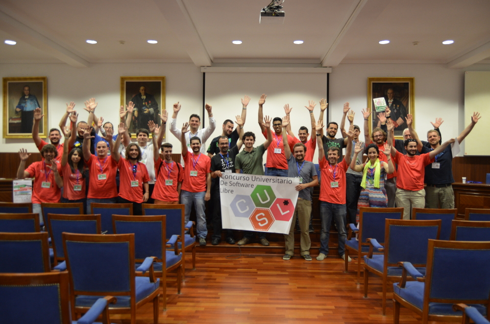

## Logros principales alcanzados

El proyecto esta recibiendo bastante interés y repercusión en Internet, como
demuestra el haber obtenido mas de 2700 Stargazers (seguidores) en GitHub y
diversas colaboraciones por parte de terceras personas, e incluso se me ha
solicitado escribir una serie de articulos en el blog tecnologico
[DCJTech](http://dcjtech.info) para hablar sobre el y la tecnologia que usa.
Ademas, tambien he recibido contactos por parte de algunas empresas interesadas
en el proyecto de cara a usarlo en sus entornos de producción como son
[crowdference](https://crowdference.org), [eFace2Face](https://eface2face.com) o
[Affinaty](http://www.affinaty.com), habiendose ofrecido su CEO
[Kenny Bentley](https://github.com/heavyk) a realizar tests de rendimiento y a
colaborar en el soporte de Docker, e incluso ha logrado algunos avances para
poder actualizr NodeOS para poder utilice las últimas versiónes de Node.js.

![Evolución del número de stargazers a lo largo del tiempo. Las marcas azules indican la participación en Node NockOut 2013, la publicación del proyecto en HackerNews y el anuncio de la version 1.0-RC1. Las marcas rojas indican el comienzo de mi participación en el proyecto (starring, primer comentario y primer commit), el nombramiento como desarrollador principal del mismo y las presentaciones que he realizado en NodeJS Madrid y CUSL. Como se puede comprobar, el proyecto incrementa a un ritmo constante el número de seguidores](img/stargazers.png)

A un nivel mas personal, este proyecto me ha permitido ser proclamado ganador
del [Primer Premio](http://www.concursosoftwarelibre.org/1415/node/34.html) en
la edición nacional del 9º Concurso Universitario de Software Libre en Mayo de
2015 en la categoria de *Sistemas*. Ademas, a raiz de dicho premio he sido
invitado a ser ponente en el OpenExpo Day 2015 para hablar sobre NodeOS y sobre
mi experiencia como participante del CUSL.

Por último, me ha permitido aprender a valorar la importancia de anotar los
cambios, evolucion y desarrollo de un proyecto para poder despues tener
referencias sobre que problemas ha habido y como se han resuelto de cara a poder
ser documentados y estudiados posteriormente, ademas de aprender sobre el
funcionamiento y administración de un sistema Linux a bajo nivel y como
orquestar los componentes minimos para que este funcione, y tambien administrar
las tareas de un equipo heterogeneo y la promoción y difusión del proyecto.
