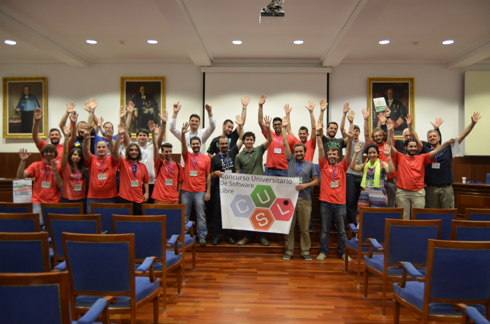

## Logros principales alcanzados

A un nivel personal, la calidad de mis contribuciones a NodeOS me permitieron
que fuese designado líder de proyecto a finales de 2014, encargándome de
decidir y organizar el rumbo que llevaría el mismo a partir de ese momento.
Además, este proyecto me ha permitido ser proclamado ganador del
[Primer Premio](http://www.concursosoftwarelibre.org/1415/node/34.html) en la
edición nacional del 9º Concurso Universitario de Software Libre en Mayo de 2015
en la categoría de *Sistemas*, por lo que he decidido inscribirme este año en la
10ª edición de dicho concurso y en el 2º Certamen de Proyectos Libres de la
[Universidad de Granada](http://osl.ugr.es/bases-de-los-premios-a-proyectos-libres-de-la-ugr).

### Charlas y presentaciones

En enero de 2015 ofrecí una charla ante los miembros del grupo de
[Node.js Madrid](http://www.meetup.com/es/Node-js-Madrid/events/219754655), la
cual tuvo una buena acogida a pesar de que el perfil medio de los asistentes no
era técnico sino desarrolladores web. Además, a raíz de ser ganador del CUSL fui
invitado a ser ponente en el
[OpenExpo Day 2015](http://www.openexpo.es/openexpo-day-2015) para hablar sobre
NodeOS y sobre mi experiencia como participante del CUSL, e igualmente he sido
invitado a escribir una serie de artículos en el blog tecnológico
[DCJTech](http://dcjtech.info) para hablar sobre el y la tecnología que usa, y
a hablar del proyecto en el podcast [The Changelog](https://changelog.com).

### Reconocimiento de la comunidad

A un nivel mas global, el proyecto está recibiendo bastante interés como
demuestra el haber obtenido más de 3400 Stargazers (seguidores) en GitHub con
diversas colaboraciones e incluso la realización de diversos proyectos
relacionados directa o indirectamente con NodeOS por parte de terceras personas
ajenas al mismo, lo que podríamos considerar los comienzos de la creación de una
comunidad de usuarios en torno a él. Además, la propia comunidad de Node.js está
[teniendo en cuenta al proyecto](https://github.com/npm/npm/issues/10894#issuecomment-168870323)
y haciendo referencias al mismo de forma activa por las contribuciones que está
aportando directa o indirectamente, como son las mejoras aportadas por
[Tyler James Leonhardt](https://tylerleonhardt.com) al proyecto
[NodeGit](http://www.nodegit.org) para poder desarrollar un cliente `git` para
la linea de comandos escrito en Javascript, en un principio enfocado solamente
para poder hacer uso de repositorios git mediante npm bajo NodeOS, pero que es
el primer paso para en un futuro próximo poder tener soporte nativo de git en
npm sin necesidad de usar herramientas externas, lo cual simplificaría mucho su
instalación y uso bajo Windows y OSX y que ha hecho que miembros de NodeGit como
[John Haley](https://github.com/johnhaley81) se hayan ofrecido personalmente a
[revisar](https://github.com/NodeOS/NodeOS/issues/67#issuecomment-173987574) los
problemas en NodeGit que están impidiendo que pueda desarrollarse dicho cliente
a pesar de las [reticencias iniciales](https://github.com/nodegit/nodegit/issues/508#issuecomment-88079486).
Esto demuestra que se está empezando a considerar a NodeOS como un jugador de
primer nivel dentro de la comunidad de Node.js, siendo capaz de generar el
interés de nuevos desarrolladores al mismo. Además también ha habido referencias
al mismo en el portal de preguntas [StackOverflow](http://stackoverflow.com/a/34005547/586382).

### Repercusión del proyecto

En los últimos años se esta produciendo un gran interés respecto a Javascript y
Node.js, lo cual ha llevado a que en una de las tiras cómicas del webcomic
[xkcd](https://xkcd.com) (muy popular entre los profesionales de la informática
y las nuevas tecnologías) se haya especulado con que en un futuro próximo pueda
haber un sistema operativo escrito en dicho lenguaje, lo cual se puede ver como
una referencia tanto a NodeOS como al kernel desarrollado por el proyecto
*runtime.js*, el cual es un concepto que ha recibido muy buenos comentarios en
[Reddit](http://www.reddit.com/r/linux/comments/31lrig/xkcd_operating_systems/cq2sp0w):

A partir de la publicación de la *Release Candidate 1* se han publicado varios
artículos y reviews en diversos sitios de internet sobre el proyecto el proyecto
en varios idiomas:

* Inglés
  * [DCJTech](http://dcjtech.info/topic/nodeos-1-0-rc1-press-note)
  * [InfoWorld Magazine](http://www.infoworld.com/article/3006978/javascript/move-over-linux-javascript-powered-nodeos-10-approaches.html)
  * [SD Times](http://sdtimes.com/nodeos-nears-1-0-in-its-quest-for-a-100-javascript-os)
  * [The Linux Homefront Project](http://tlhp.ml/node-os-review) (review
    independiente muy completa y en profundidad con varios ejemplos de uso)
  * [Silvae Technologies](http://silvaetechnologies.eu/blg/127/nodeos-1-0-to-base-entirely-on-javascipt-and-make-developer%E2%80%99s-life-easier)
  * [Toptal](http://www.toptal.com/nodejs/nodeos-the-javascript-based-operating-system)
* Español
  * [GenBeta:Dev](http://www.genbetadev.com/actualidad/minecraft-virus-historicos-c-nomadas-drupal-8-pull-request-49)
  * [Mis apuntes de...](http://misapuntesde.com/post.php?id=644)
* Alemán
  * [Heise Developer](http://www.heise.de/developer/meldung/NodeOS-Das-Linux-fuer-und-mit-Node-js-3013784.html)
  * [entwickler](https://entwickler.de/online/javascript/nodeos-1.0-rc1-192086.html)
* Francés
  * [Developpez](http://www.developpez.com/actu/92986/NodeOS-l-OS-leger-base-sur-le-noyau-Linux-Node-js-et-le-gestionnaire-de-paquets-npm-approche-sa-premiere-versión-majeure)
  * [TooLinux](http://www.toolinux.com/NodeOS-1-0-presque-denoue)
* Ruso
  * [vk](http://vk.com/ubuntulinux?w=wall-33241_432911%2Fcd8fbdf2641e4e68b8)
  * [OpenNet](http://www.opennet.ru/opennews/art.shtml?num=43386)
  * [TAdviser](http://www.tadviser.ru/index.php/Продукт:NodeOS)
* Chino
  * [Techug](http://www.techug.com/nodeos-the-javascript)

Esto ha hecho que el número de seguidores haya aumentado desde entonces en 500
personas en apenas un mes:

![Evolución del número de stargazers a lo largo del tiempo. Las marcas azules indican la participación en Node NockOut 2013, la publicación del proyecto en HackerNews y el anuncio de la versión 1.0-RC1. Las marcas rojas indican el comienzo de mi participación en el proyecto (starring, primer comentario y primer commit), el nombramiento como desarrollador principal del mismo y las presentaciones que he realizado en NodeJS Madrid y CUSL. Como se puede comprobar, el número de seguidores aumenta normalmente a un ritmo constante, pero se incrementa notablemente después de cada una de las notificaciones oficiales](img/stargazers.png)

NodeOS ha sido incluido dentro de la lista de proyectos que hacen uso de la
librería [musl](http://wiki.musl-libc.org/wiki/Projects_using_musl), dándole
implícitamente cierto respaldo. También he recibido contactos por parte de
algunas empresas interesadas en el proyecto de cara a usarlo en sus entornos
de producción como son [crowdference](https://crowdference.org),
[eFace2Face](https://eface2face.com) o [Affinaty](http://www.affinaty.com),
habiéndose ofrecido su CEO [Kenny Bentley](https://github.com/heavyk) a
realizar personalmente algunos tests de rendimiento y a colaborar en el soporte
de Docker, e incluso ha logrado algunos avances importantes para poder usar
versiones mas recientes de *gcc* que permitan actualizar la versión de Node.js
empleada por NodeOS o incluso facilitar el portarlo a otras arquitecturas de CPU.
No obstante, estos contactos han sido puntuales y todavía necesita mas apoyo por
parte de la comunidad o de alguna empresa o institución interesada en que salga
adelante para que el proyecto pueda llegar a tener éxito a largo plazo.
