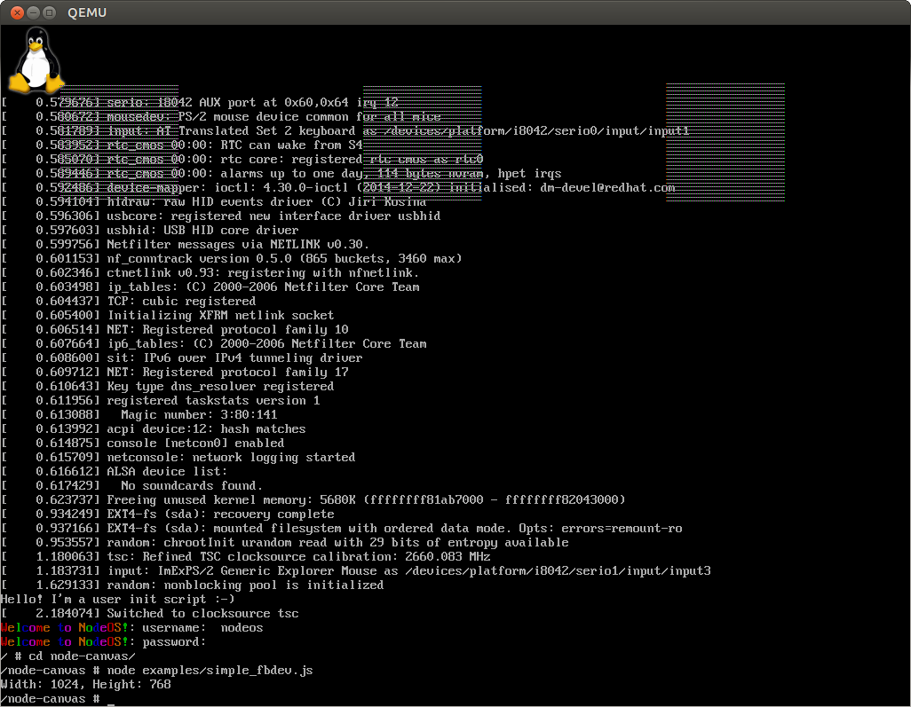
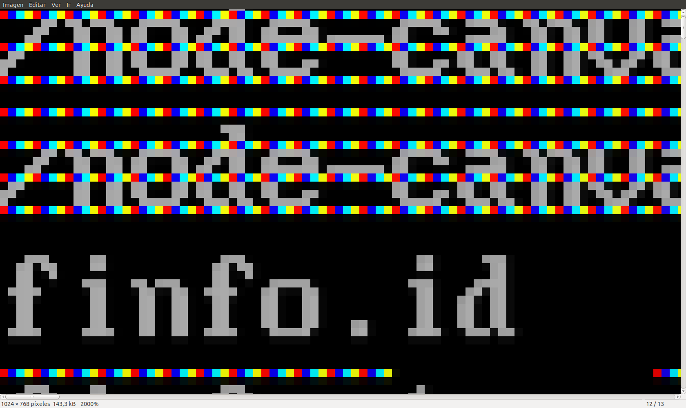
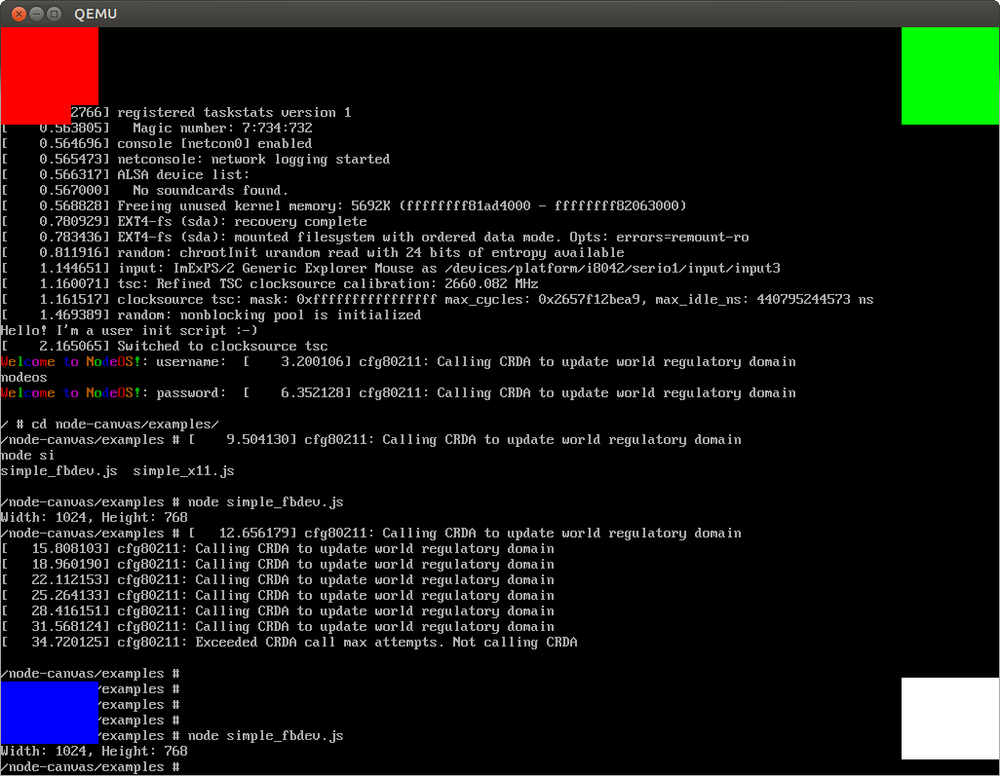

#### node-canvas

La forma mas sencilla de poder mostrar graficos en la consola de Linux es
utilizando el [dispositivo de framebuffer](https://es.wikipedia.org/wiki/Fbdev),
el cual proporciona acceso a directo la región de memoria correspondiente a la
pantalla para poder modificarla. En un principio se penso en crear un modulo de
Node.js para que el usuario pudiera controlar dicho dispositivo facilmente sin
tener que usar directamente la interfaz proporcionada por el kernel de Linux
implementando todas las llamadas al sistema correspondientes como funciones,
pero mas tarde se decidio usar en su lugar el modulo [node-canvas](https://github.com/Automattic/node-canvas), el cual proporciona
una implementacion de la API de
[Canvas](https://developer.mozilla.org/en-US/docs/Web/API/Canvas_API) de HTML y
ademas es el módulo estandar *de-facto* para renderizar imagenes en Node.js en
el servidor, ofreciendo por tanto compatibilidad con las aplicaciones existentes
para Node.js que usen dicho módulo como con las aplicaciones web que hagan uso
del componente, principalmente juegos y animaciones. Dicho módulo es en si un
wrapper en torno a la libreria [Cairo](http://cairographics.org), la cual
proporciona un framework multiplataforma para el dibujado de gráficos
vectoriales y que es usada por multiples proyectos de Software Libre entre ellos
la libreria de componentes graficos [GTK](http://www.gtk.org), usada por
[Gnome](https://www.gnome.org) y [XFCE](http://www.xfce.org), dos de los
entornos de escritorio mas populares en Linux.

Debido al diseño de NodeOS donde no hay componentes o librerias globales comunes
para todos los usuarios, para poder usar *node-canvas* se ha tenido en primer
lugar que añadir soporte para poder compilarlo como una libreria dinamica
linkada estaticamente. De esta forma, todas sus dependencias (`Cairo`,
`FreeType`, `giflib`, `libjpeg-turbo`, `libpng`, `pixman` y `zlib`) estan
incluidas dentro del propio modulo una vez generado sin tener dependencias de
ninguna libreria externa (lo cual es la forma recomendada de desarrollar modulos
[compilados en Node.js](https://n8.io/converting-a-c-library-to-gyp) por razones
de portabilidad), en lugar del metedo actual por el que se estan utilizando las
librerias globales del sistema. Ya habia habido algunos intentos anteriores para
añadir [esta funcionalidad](https://github.com/magicode/node-canvas), aunque
dichos cambios nunca llegaron a integrarse en el codigo principal. Sin embargo,
decidi usarlos como base debido a la calidad de su codigo, el cual separaba el
script de generacion del modulo segun fuese a utilizarse el linkado estatico o
por el contrario fuesen a emplearse las librerias dinamicas instaladas
globalmente en el sistema.

El otro elemento fundamental para poder usar *node-canvas* para mostrar los
gráficos en la pantalla es el propio soporte de framebuffer como destino para
las operaciones de dibujado. Cairo tiene soporte nativo para el mismo, con lo
que solo es cuestion de configurar *node-canvas* de forma que pueda utilizarlo.
Para ello me he basado en codigo previo realizado por
[Rene Hollander](https://github.com/ReneHollander/node-canvas), el cual a raiz
del [issue](https://github.com/Automattic/node-canvas/issues/533) que abri en el
repositorio de *node-canvas* solicitando el soporte para el framebuffer de Linux
hizo una prueba de concepto para añadirlo, y ademas ha implementado un sistema
por el cual el usuario puede configurar facilmente que sistema grafico quiere
utilizar (imagen, framebuffer, EGL, X11, Wayland, Quartz, GDI, SVG, PDF...)
aparte de poder configurar en tiempo de compilacion que sistemas gráficos
nativos estaran disponibles posteriormente por el módulo.

Al estar ambas funcionalidades actualmente en desarrollo y sin integrar en el
repositorio principal, las he [combinado](https://github.com/NodeOS/node-canvas)
en un repositorio propio. A pesar de haberse hecho la mezcla de ambos forks sin
conflictos, al hacerlo me he encontrado con
[diversos problemas](https://github.com/Automattic/node-canvas/issues/551),
algunos debidos a la forma tan poco comun en la que es compilado el módulo
(libreria dinamica linkada estaticamente y usando `musl` como libreria estandar)
y debido a esto mismo tambien la aparicion de algunos bugs que estaban ocultos
en entornos de desarrollo mas comunes:

* El primero de ellos fue el hecho de que no se estaba forzando que el linkado
  fuese estatico mediante el flag `-static`, por lo que aunque se estuviesen
  descargando y compilando las dependencias del modulo como librerias estaticas,
  estas solo se usarian en caso de que no se encontrase su version dinamica
  entre las librerias globales del sistema, lo cual podria dar problemas con el
  cross-compiler de NodeOS. Sin embargo, al añadir dicho flag obtuve algunos
  errores relativos a que el objeto `crtBeginT.o` debe de ser compilado como
  [Codigo Independiente de la Posicion](https://en.wikipedia.org/wiki/Position-independent_code)
  (*PIC*), ya que estamos haciendo una libreria dinamica. Esto es debido a un
  [bug en gcc sin resolver](https://bugzilla.redhat.com/show_bug.cgi?id=214465#c1)
  debido a que sus desarrolladores no quieren que se usen simultaneamente los
  flags `-shared` (para crear una libreria dinamica) y `-static` (para forzar a
  que se linken estaticamente todas sus dependencias) promoviendo que se usen en
  su lugar librerias dinamicas en todos los casos a pesar de haber casos de uso validos como son la creacion de plugins y/o modulos compilados de Node.js
  (como es este mismo caso). La solucion empleada en un principio fue
  [reemplazar](https://bugs.launchpad.net/ubuntu/+source/gcc-4.4/+bug/640734/comments/6)
  dicho archivo por el contenido de `crtBeginS.o`, el cual esta orientado a su
  uso en librerias dinamicas y por tanto compilado usando el necesario flag
  `-fPIC`. Esto es asi al parecer porque el uso de *Codigo Independiente de
  Posicion* añade una pequeña penalizacion en el rendimiento y por tanto se
  tienen dos versiones especializadas de dicho archivo, Este problema no afecta
  a otros compiladores como [LLVM](http://llvm.org) ya que solo utilizan una
  única versión del archivo. Sin embargo esto tiene el problema de que dicha
  sustitución tendria que hacerse en todos los sistemas para los que se vaya a
  compilar el modulo y no solamente cuando sea NodeOS el objetivo, por lo que se
  ha optado por una solucion menos invasiva consistente en indicar en el archivo
  de configuración de *node-gyp* (`binding.gyp`) de forma explicita la ubicacion
  de todas las librerias estaticas contra las que debe ser linkado (que
  corresponden a las dependencias que hemos bajado y compilado previamente), de
  forma que ya no sea necesario hacer uso del uso del flag `-static`, y evitando
  tambien los problemas asociados a su uso con `gcc` indicados antes. Una vez
  hecho este cambio, el módulo pudo compilarse sin problemas bajo Ubuntu usando
  `glibc` como libreria estandar y ejecutarse los tests correctamente. No
  obstante, los ejemplos relativos al uso del framebuffer no mostraban nada en
  pantalla, lo que luego resulto ser debido al hecho de que equipo usado durante
  las pruebas (un portatil MacBook Pro) incorpora dos tarjetas graficas (Intel
  en fb0 y NVidia en fb1), estando activada por defecto la secundaria. Una vez
  modificado el módulo para poder configurar desde Javascript el dispositivo de
  [framebuffer a usar](https://github.com/ReneHollander/node-canvas/issues/2),
  dichos ejemplos ya pudieron ejecutarse nativamente en mi equipo:
  
* Despues, al intentar compilar el módulo con el cross-compiler de NodeOS, este
  me notifico que no podia encontrar el archivo `zlib.h` y algunos otros
  archivos de cabecera, lo cual lo solucione incluyendo los directorios
  faltantes desde las librerias descargadas. Algo similar ocurrio con el archivo
  `fontconfig/fontconfig.h`, perteneciente a una dependencia no documentada de
  [FontConfig](http://www.freedesktop.org/wiki/Software/fontconfig), libreria
  usada en varios sistemas UNIX para la gestion de fuentes tipograficas y
  habitualmente disponible en cualquier distribucion de Linux estandar. Dicho
  archivo solo contiene algunas constantes y estructuras de datos, por lo que
  este problema lo he solucionado descargando dicho archivo desde su
  [repositorio](http://cgit.freedesktop.org/fontconfig/plain/fontconfig/fontconfig.h)
  del mismo modo que el resto de librerias y configurando el script de
  compilacion para que sea usado en caso de estar generando un modulo linkado
  estaticamente o en un sistema que no tenga las librerias necesarias instaladas
  globalmente, como es el caso de NodeOS.
* Una vez que consegui que se pudiera compilar el modulo con el cross-compiler
  de NodeOS, al probarlo obtuve un error relativo a que no se podia encontrar la
  funcion `jinit_arith_decode`, perteneciente a *libjpeg-turbo*, una de las
  dependencias de *node-canvas*, a pesar de que la compilacion no dio ningun
  fallo. Despues de [preguntar](http://www.openwall.com/lists/musl/2015/06/26/1)
  en la lista de correo de musl (al ser la única diferencia con respecto a la
  compilacion nativa en Ubuntu usango `glibc`) y tambien de hacer varias pruebas
  usando [nm](https://sourceware.org/binutils/docs-2.23/binutils/nm.html) para
  inspeccionar la lista de simbolos exportados por las librerias y deshabilitar
  algunas funcionalidades, consegui gracias a la ayuda en especial de
  [siblynx](https://github.com/siblynx) y [Szabolcs Nagy](mailto:nsz@port70.net)
  llegar a la conclusion de que el problema era que
  [no se estaban compilando](http://www.openwall.com/lists/musl/2015/06/28/8)
  los archivos que proporcionan algunas de las funciones que son requeridas por
  *Cairo* (entre ellas la anteriormente citada `jinit_arith_decode`), bien
  porque dichos archivos estaban comentados en la configuracion de `gyp` o
  directamente no estaban incluidos en estos, unido al hecho que por defecto el
  [compilador gcc no notifica](http://www.openwall.com/lists/musl/2015/06/27/1)
  errores sobre simbolos sin resolver al generar librerias dinamicas, ya que
  estos pueden ser resueltos posteriormente al ser cargados si en dicho momento
  estan definidos[^1]. Para forzar a que notificara dichos errores para poder
  buscar posteriormente los archivos donde estan definidos e incluirlos en el
  proceso de compilación de GYP se ha usado el flag
  [--no-undefined](https://blog.flameeyes.eu/2010/09/your-worst-enemy-undefined-symbols),
  lo cual ha permitido comprobar que dicho problema tambien se estaba
  produciendo al ser compilado con `glibc`, solo que dicho problema no se estaba
  manifestando ya que por diseño `glibc` realiza la busqueda y linkado de los
  simbolos en el momento de ser utilizados (*lazy loading*) a diferencia de
  `musl` que lo hace en el momento de ser cargada la libreria (generalmente en
  el arranque del programa, o en el caso de los modulos compilados de Node.js,
  al importarlos al llamar a la funcion `require()`). Esto tambien sirvio para
  descubrir un error relativo a un conflicto entre versiones de Node.js al
  compilar modulos binarios usando el cross-compiler, ya que estaba usando las
  cabeceras de desarrollo de la version de Node.js instalada en el sistema en
  vez de las correspondientes a la usada en la compilacion de NodeOS y por tanto
  tambien aparecian como no definidas algunas funciones y metodos pertenecientes
  a Node.js y v8 que deberian haberse resuelto al cargar el modulo.
* Por ultimo y relacionado con el punto anterior, el mecanismo de selección de
  sistemas graficos tenia un fallo por el cual no estaba definido un metodo
  destructor en la clase base abstracta de la cual heredan cada uno de ellos.
  Esto en situaciones normales no causaria problemas debido al *lazy loading* (o
  a lo sumo se generaria un core dump cuyos efectos quedarian ocultos al
  producirse generalmente durante el cierre normal de la aplicacion), pero al
  haberse compilado en NodeOS usando `musl` la ausencia de dicho destructor
  virtual se mostro justo en el momento de cargar el modulo. Al implementar un
  metodo vacio para solucionar dicho problema, decidi tambien reubicar otros
  metodos que estaban definidos en el archivo de cabecera en un archivo propio
  para ahorrar memoria y organizar mejor el codigo, momento en que encontre
  casualmente otro bug oculto relativo a la definicion del tamaño del
  framebuffer que habia estado dando algunos problemas a otros
  [usuarios](https://github.com/ReneHollander/node-canvas/issues/1).

Una vez solucionados todos estos problemas, finalmente pude utilizar el módulo
para [acceder](https://github.com/NodeOS/NodeOS/issues/39#issuecomment-116304688)
al dispositivo framebuffer y poder modificar su contenido:

En la figura puede verse el resultado de dibujar un cuadrado de color verde en
el disposivo framebuffer de QEmu usando *node-canvas*. El hecho que se vean 3
cuadrados grisaceos es debido a que la tarjeta grafica que emula QEmu por
defecto (Cirrus Logic 54xx) utiliza 24 bits para mostrar colores reales (RGB, 8
bits x 3) a diferencia de todas las tarjetas graficas actuales como la que
incorpora el equipo usando durante las pruebas (NVidia GeForce GT 330M), las
cuales usan 32 bits (RGB + alpha).
[Cairo no tiene soporte para color de 24 bits real](http://cairographics.org/manual/cairo-Image-Surfaces.html),
usando en su lugar 32 bits ignorando el canal alpha, motivo por el que al
dibujar directamente en el disposivo de framebuffer y no coincidir sus modos de
almacenamiento de los pixels (3 bytes en framebuffer vs. 4 bytes en Cairo) se
da una mala alineación y un desplazamiento de estos que produce un patron de
colores que le da un aspecto grisaceo. Relaccionado con este hecho se da la
situacion de que no coincide el desplazamiento entre lineas
([stride](http://cairographics.org/manual/cairo-Image-Surfaces.html#cairo-format-stride-for-width)).
En condiciones normales este corresponde a la
[longitud de cada linea](http://lxr.free-electrons.com/source/include/uapi/linux/fb.h#L167)
en el framebuffer la cual es fija independientemente de la resolucion empleada,
pero esta da un valor incorrecto para Cairo cuando se usa bajo QEmu en 24 bits,
lo cual provoca que aparezca la imagen triplicada y con lineas en blanco (1024 x
4 bytes = 4096 bytes, cuando la longitud de cada linea es de 1024 x 3 bytes =
3072 bytes, con lo que los pixeles quedan alineados en pantalla cada 4 lineas
del framebuffer, o 12288 bytes):

La solucion para ambos problemas ha pasado por hacer uso de la tarjeta grafica
[stdvga](https://www.kraxel.org/blog/2014/10/qemu-using-cirrus-considered-harmful)
(QEmu ofrece por defecto la tarjeta grafica Cirrus por retrocompatibilidad) la
cual ofrece un comportamiento acorde a las tarjetas graficas reales actuales
como es el uso de color real en 32 bits o resoluciones en formato panoramico.
Tambien para evitar problemas posteriores he hecho que el backend solo admita
profundidades de color de 16 y 32 bits empaquetados en formato 565 y ARGB puesto
que son los unicos que comparten nativamente tanto Cairo como el disposito de
framebuffer, lanzando una excepcion si se intenta usar cualquier otro modo. No
obstante, seria posible el utilizar tambien el formato RGB de 24 bits utilizando
dos buffers independientes y convirtiendo la informacion de color entre ellos,
pero esto provocaria una perdida de rendimiento debido a que Cairo no ofrece
ningun medio de notificar cuando los datos en una superficie se han actualizado,
por lo que la unica manera posible de tener ambos buffers sincronizados es
copiando los datos a intervalos regulares mediante el uso de timers.

El ultimo problema encontrado durante la portabilidad de *node-canvas* a NodeOS
ha venido dado por el uso de Cairo de los tipos de datos `__uint128_t` y
`__int128_t`, los cuales son extensiones ofrecidas por gcc y que solo estan
disponibles para sistemas de 64 bits, por lo que no ha sido posible compilar el
modulo para la version de 32 bits de NodeOS. Se ha notificado del problema a en
el [bugtracker](https://bugs.freedesktop.org/show_bug.cgi?id=91473) de Cairo.

No obstante, tambien he aprovechado para hacer algunas mejoras en el código. La
primera de ellas ha sido separar el directorio de descarga de las librerias
externas, ya que estas se estaban guardando en el mismo directorio donde estaban
definidos sus scripts de compilacion y sus configuraciones, haciendo dificil el
poder limpiar el espacio de trabajo. Ademas, se estaban usando los números de
version de las librerias en las propias rutas donde se estaban descargando, por
lo que tambien he hecho este proceso generico para que sean mas faciles de
actualizar al estar definidos los números de version en un unico lugar. Una vez
hecho esto, modifique el script de instalación de las dependencias eliminando
código duplicado e integrandolo dentro de funciones reusables y con mejor
gestion de errores, de forma que fuese mas facil de mantener en el futuro.
Ademas, ahora se descomprimen los archivos en su ubicacion final a medida que se
descargan los tarballs sin necesidad de guardarlos previamente en el disco duro,
de forma que el proceso es mas rapido y consume menos recursos. Una vez
realizados todos estos cambios y mejoras he abierto un pull-request en el
proyecto [solicitando](https://github.com/Automattic/node-canvas/pull/571) que
sean incorporados al repositorio principal, el cual esta actualmente pendiente
de aprobacion.

Durante la realizacion de todos estos cambios tambien he caido en la cuenta de
que muchos de estos problemas se podrian solucionar mediante una generación mas
modular, aparte de que se reducirian los tiempos de compilacion y la memoria y
ancho de banda consumidos, por lo que he propuesto el que los modulos compilados
[puedan indicar sus dependencias](https://github.com/joyent/node/issues/25627),
de tal forma que no tengan que estar instaladas globalmente en el sistema o
compiladas estaticamente dentro del propio modulo sino en otros modulos
reutilizables. Esto se basaria en el hecho de que los simbolos no definidos en
una libreria dinamica son resueltos al ser cargados y ademas que todos coexisten
despues en el mismo espacio de memoria, por lo que seria factible el cargar los
modulos de las dependencias antes que el propio modulo, de tal forma que puedan
estar disponibles todos sus simbolos en memoria y funcionar correctamente.

[^1]: La unica razon por la que dichos errores no se detectaron antes al
      ejecutar los tests solo es posible porque estos no sean lo suficientemente
      exhaustivos, por lo que he abierto un
      [issue](https://github.com/Automattic/node-canvas/issues/577) en el
      proyecto notificandolo y solicitanto que se compruebe cual es el
      porcentaje de cobertura de los tests para evitar problemas similares en el
      futuro.
