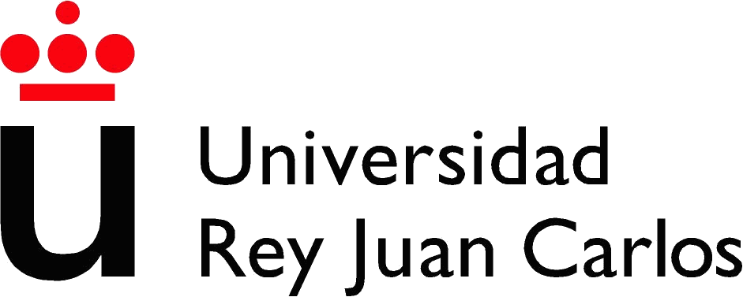

## Escuela Superior de Ingenieria Informática
## Ingenieria Informática
### Curso Académico 2014/2015
### Proyecto de Fin de Carrera
# ShareIt!: framework para desarrollo de aplicaciones P2P en Javascript
#### Autor: Jesús Leganés Combarro
#### Tutores: los tutores del proyecto
